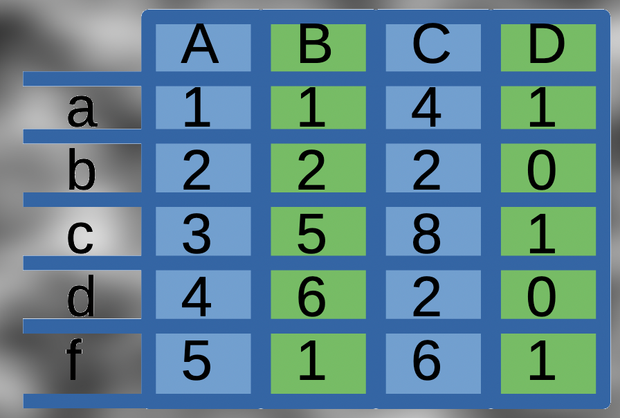

# Lab 02: Data Frames, Statistics and Visualization in R

## Assigned and Due

* __Assigned__: Thursday, 17th September 2026 at 2:30pm
* __Due__: Thursday, 24th September 2026 at 11:59pm
* __Expiration__: Thursday, 1st October 2026 at 11:59pm

Note: the _expiration_ date is the last date you can submit your work for a grade.

Some elements of this lab were written or corrected by Claud.

<center>



</center>

## 🎯 Learning Objectives

Welcome to Lab 02! This week, you will dig into the data structure that powers most of data science in R: the **data frame**. You will build data frames from scratch, load built-in R datasets, read in a real CSV file, run statistical summaries, and create visualizations — all while fixing intentionally broken code along the way.

By the end of this lab, you will be able to:
- Create a data frame with `data.frame()` and access its rows, columns, and subsets
- Explore built-in R datasets (`mtcars`, `iris`) using `str()`, `summary()`, and `head()`
- Read an external `.csv` file into R with `read.csv()`
- Detect and handle missing data (`NA`) using two different strategies
- Compute descriptive statistics: mean, median, standard deviation, quantiles, and correlation
- Compute grouped summaries with `aggregate()` and `tapply()`
- Build visualizations with `plot()`, `hist()`, `boxplot()`, and `pairs()`
- Use a Shiny app to interactively build data frames and generate plots

## 📚 Lab Overview

You have **one week** to complete this lab. There are **five R programs**, each focused on one part of the data analysis workflow. Each program contains a working example built by your instructor — but several lines have been intentionally broken! Your job is to find each bug, understand *why* it's wrong, and fix it using the hints provided.

After completing the five programs, you'll explore a fully working **Shiny app** that lets you build your own data frame and generate plots interactively — no bugs to fix there, just explore and think critically about what you see.


## 🚀 Getting Started

1. **Create a local working space**: A local directory is used to keep all your labs together in the same spot on your local machine and will help you locate them for future use. Please note that these local repositories are **located on your machine** and will still need to be pushed to GitHub. The UNIX command to create a local directory `cs301Fall2026/labs` is as follows (if you are using a Windows machine, you can create the directory using File Explorer or use Git Bash to run the command below):

    ```bash
    mkdir -p cs301Fall2026/labs
    ```

Keep all your labs together in this local directory. If you are working with an activity, create a similar local directory for your course activities.

2. **Clone this repository** to your computer. Use the command: `git clone <your-repo-url>` to clone the repository.
3. **Open the lab folder as an RStudio Project**: In RStudio, choose *File → Open Project* and select this lab's folder. This makes sure your **working directory** is set correctly, so relative paths like `data/student_survey.csv` will work.
4. **Open the `src/student/` folder** in RStudio and copy each program's code into a new R script (or work directly in a copy you create) — this is your deliverable.
5. **Look for `TODO` and `BUG`/`HINT` comments** - these tell you exactly where to add code or fix a mistake. Please be sure to **REMOVE the `TODO` comments** after you have completed each task.
6. **Run each program** to test your work, either line-by-line in the RStudio console or with `Rscript src/student/program1_creating_dataframes.R` from the terminal.
7. **Explore the Shiny app** in `src/shiny_app.R` once you finish the five programs.
8. **Fill out `writing/reflection.md`** when you are done coding and exploring.


## 📝 Program Descriptions

### Program 1: Creating and Exploring Data Frames 🗂️

**File:** `src/student/program1_creating_dataframes.R`

**What You will Learn:** Building a `data.frame()`, inspecting it with `str()`/`summary()`, and accessing rows, columns, and subsets.

**What It Does:**

- Builds a small data frame of five students (name, age, major, GPA, honors status)
- Prints the structure and summary statistics of the data frame
- Accesses a single column, a single row, and a logical subset
- Adds a new computed column (`gpa_percent`)

**Bugs to fix:** a mismatched vector length, an incorrectly capitalized column name, a missing comma in row indexing, `=` used instead of `==`, and a typo in a column name.

**Key Concepts:** `data.frame()`, `$` access, row/column indexing, logical subsetting, `str()`, `summary()`


### Program 2: Exploring Built-in Datasets 🚗🌸

**File:** `src/student/program2_builtin_datasets.R`

**What You will Learn:** Working with R's built-in practice datasets, `mtcars` and `iris`.

**What It Does:**

- Loads `mtcars` and previews it with `head()` and `str()`
- Filters cars with good fuel economy
- Computes average horsepower
- Loads `iris` and computes grouped averages and counts by species

**Bugs to fix:** a missing comma in row filtering, incorrectly capitalized column names in `mtcars` and `iris`.

**Key Concepts:** `data()`, `head()`, `str()`, row filtering, `aggregate()`, `table()`


### Program 3: Reading and Cleaning CSV Data 📁

**File:** `src/student/program3_reading_csv.R`

**What You will Learn:** Reading an external `.csv` file and handling missing data.

**What It Does:**

- Reads `data/student_survey.csv`, a synthetic dataset of 28 students (major, study hours, sleep hours, coffee cups, exam score)
- Counts missing values per column
- Drops rows with a missing `exam_score`
- Fills missing `study_hours` values with the column mean

**Bugs to fix:** an incorrect file path, a missing `!` (NOT) when filtering out missing values, a missing `na.rm = TRUE`, and incomplete code to fill in missing values.

**Key Concepts:** `read.csv()`, `is.na()`, `colSums()`, dropping vs. imputing missing data


### Program 4: Statistical Analysis 📈

**File:** `src/student/program4_statistical_analysis.R`

**What You will Learn:** Descriptive statistics and grouped summaries.

**What It Does:**

- Computes mean, median, standard deviation, range, and quantiles of exam scores
- Computes the correlation between `study_hours` and `exam_score`
- Computes average exam score and average study hours grouped by major
- Identifies students scoring above the class average

**Bugs to fix:** an invalid function name for standard deviation, a missing `use = "complete.obs"` in `cor()`, a missing `na.rm = TRUE` in `tapply()`, and incomplete code for the final filtering step.

**Key Concepts:** `mean()`, `median()`, `sd()`, `quantile()`, `cor()`, `aggregate()`, `tapply()`


### Program 5: Data Visualization 📊

**File:** `src/student/program5_data_visualization.R`

**What You will Learn:** Creating scatterplots, histograms, boxplots, and scatterplot matrices with base R.

**What It Does:**

- Creates a scatterplot of `study_hours` vs. `exam_score` with a trend line
- Creates a histogram of exam scores
- Creates a boxplot of exam scores grouped by major
- Creates a scatterplot matrix of the `iris` measurements

**Bugs to fix:** reversed formula arguments in `lm()`, incomplete histogram code, a reversed formula in `boxplot()`, and an incorrect column range passed to `pairs()`.

**Key Concepts:** `plot()`, `abline()`, `lm()`, `hist()`, `boxplot()`, `pairs()`


## 🎮 Bonus: The Shiny App

**File:** `src/shiny_app.R`

This app is **provided complete** — there is nothing to fix! Open it in RStudio and click **Run App**, or run:

```r
install.packages("shiny")  # only needed once
shiny::runApp("src/shiny_app.R")
```

The app lets you:

- Choose a built-in synthetic dataset (the student survey, `mtcars`, `iris`, or a synthetic sales dataset) **or** type in your own X and Y values to build a custom data frame
- Generate a scatterplot, histogram, or boxplot from your data
- Preview the underlying data frame in a table

Spend some time exploring different datasets, columns, and plot types before you answer the Shiny app critical thinking questions in your reflection.


## ✅ How to Complete This Lab

1. **Work through each program in order** - later programs assume you understand earlier concepts.
2. **Read the `BUG` and `HINT` comments carefully** - they tell you exactly what's wrong and how to think about the fix.
3. **Test your code frequently** - run the program after each fix.
4. **Don't be afraid to experiment** - try things in the RStudio console and see what happens.
5. **Ask for help if you are stuck** - that's what learning is all about!

## 🧪 Testing Your Code

To run any program from the terminal (with the lab folder as your working directory):

```bash
Rscript src/student/program1_creating_dataframes.R
Rscript src/student/program2_builtin_datasets.R
Rscript src/student/program3_reading_csv.R
Rscript src/student/program4_statistical_analysis.R
Rscript src/student/program5_data_visualization.R
```

You can also run each script line-by-line in RStudio to see the results and plots as you go.


## 📖 Reflection Questions

Once you've completed all five programs and explored the Shiny app, answer the questions in `writing/reflection.md`. These questions will help you think deeply about data frames, statistics, visualization choices, and the responsible use of interactive tools.


## 📤 Submission

When you are ready to submit:

1. Make sure all five programs run without errors and produce sensible output
2. Complete the `writing/reflection.md` file
3. Test each program one more time
4. Commit and push your changes to GitHub
5. Submit the link to your repository

### Committing and Pushing Your Work

As you are working on your lab, you are to commit and push regularly. The commands (in the bash terminal) are shown below. Note: You can also use your VSCode editor (or similar) to commit and push your work. After you have pushed your work to your repository, please visit the repository at the GitHub website (you may have to log-in using your browser) to verify that your files were correctly sent.

``` bash
git add -A
git commit -m "Your notes about commit here"
git push
```


## Project Assessment

The grade that a student receives on this assignment will have the following components.

* **GitHub Actions CI Build Status [up to 15%]:**: For the lab repository associated with this assignment students will receive a checkmark grade if their last before-the-deadline build passes. This is only checking some baseline writing and commit requirements as well as correct running of the program. An additional reduction will given if the commit log shows a cluster of commits at the end clearly used just to pass this requirement. An addition reduction will also be given if there is no commit during lab work times. All other requirements are evaluated manually.

* **Mastery of Technical Writing [up to 50%]:**: Students will also receive a checkmark grade when the responses to the writing questions presented in the `reflection.md` reveal a proficiency of both writing skills and technical knowledge. To receive a checkmark grade, the submitted writing should have correct spelling, grammar, and punctuation in addition to following the rules of Markdown and providing conceptually and technically accurate answers.

* **Mastery of Technical Knowledge and Skills [up to 35%]**: Students will receive a portion of their assignment grade when their program implementation reveals that they have mastered all of the technical knowledge and skills developed during the completion of this assignment. As a part of this grade, the instructor will assess aspects of the programming including, but not limited to, the completeness and the correctness of the program and the use of effective source code comments.

## Code Review Component

As a separate grade, students will be required to complete code reviews of labs with the instructor or a Technical Leader. During this session, the student will be asked to demonstrate their understanding of the code they have written, and to provide responses to questions concerning specific programming concepts used in their implementation. The topics for this week's lab are listed below.

* Demonstrate working code (no errors during execution).
* Demonstrate documentation in code.
* Demonstrate that the code is complete, according to the assignment specifications.
* Discussion of `data.frame()` indexing, missing data handling, and the difference between `aggregate()` and `tapply()`.
* Discussion of other commands and parts of code


## GatorGrade

### Checks for GatorGrade

For immediate feedback on submissions, we will be using Gator Grade to inform the of missing components in the submission. As you submit, you will notice that there is a thick red X that will change to a green check mark when all components have been included in the submission. You are encouraged to click on the red X to find a listing of the components to address.

You can check the baseline writing and commit requirements for this lab assignment by running department's assignment checking `gatorgrade` tool. To use `gatorgrade`, you first need to make sure you have Python3 installed (type `python --version` to check). If you do not have Python installed, please see:

- [Setting Up Python on Windows](https://realpython.com/lessons/python-windows-setup/)
- [Python 3 Installation and Setup Guide](https://realpython.com/installing-python/)
- [How to Install Python 3 and Set Up a Local Programming Environment on Windows 10](https://www.digitalocean.com/community/tutorials/how-to-install-python-3-and-set-up-a-local-programming-environment-on-windows-10)

Then, if you have not done so already, you need to install `gatorgrade`:

- First, [install `pipx`](https://pypa.github.io/pipx/installation/)
- Then, install `gatorgrade` with `pipx install gatorgrade`

Finally, you can run `gatorgrade`: `gatorgrade --config config/gatorgrade.yml`


## Seeking Assistance

If you are stuck:

1. Read the `BUG` and `HINT` comments in the code
2. Review the class materials (especially the Data Structures slide deck)
3. Try breaking the problem into smaller steps
4. Ask a classmate, Technical Leaders or your instructor

* Extra resources for using markdown include;
  + [Markdown Tidbits](https://www.youtube.com/watch?v=cdJEUAy5IyA)
  + [Markdown Cheatsheet](https://github.com/adam-p/markdown-here/wiki/Markdown-Cheatsheet)
* Extra resources for R and RStudio include;
  + [RStudio IDE Cheatsheet](https://posit.co/resources/cheatsheets/)
  + [R for Data Science (free online book)](https://r4ds.hadley.nz/)

Students who have questions about this project outside of the lab time are invited to ask them in the course's Discord channel or during instructor's or TL's office hours.
